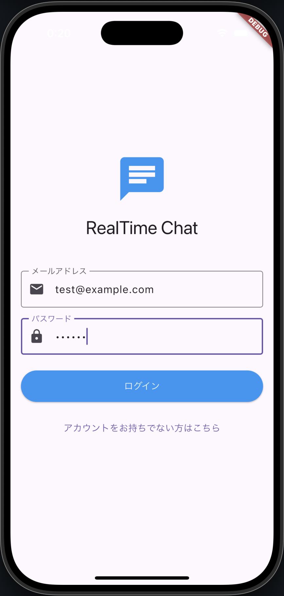
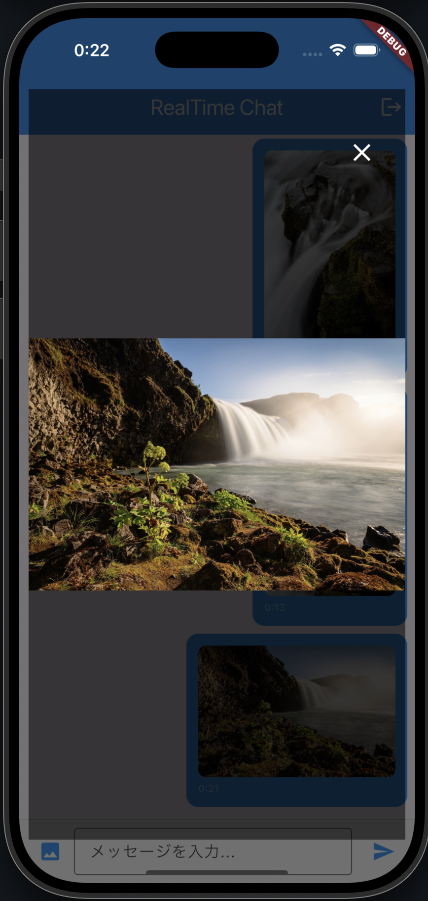

# Libecity Chat

リアルタイムチャットアプリケーション（Flutter + Firebase）

## 🎯 概要

FirebaseとFlutterを使用したリアルタイムチャットアプリです。  
複数端末間でのリアルタイム同期、画像送信、既読機能などを実装しています。

**デモサイト**: [https://libecity-app.firebaseapp.com](https://libecity-app.firebaseapp.com)

## 📱 スクリーンショット

  
  
  

## 【開発環境・技術スタック】
- **Flutter**（Dart）
- **Firebase**
  - Authentication（認証）
  - Firestore（DB）
  - Storage（画像保存）
  - Hosting（デモサイト公開：Web版）
- **Riverpod**（状態管理）
- **Claude Code**（AI開発支援）
- **GitHub**（バージョン管理）
- **GitHub Actions**（CI）
- **【未実装】Hive**（ローカルキャッシュ）

## 【主要機能】

### 認証システム
- メール/パスワード認証（Firebase Auth）
- 認証状態による画面自動切り替え（StreamProvider）

### メッセージング
- リアルタイム送受信（StreamProvider）
- 複数端末間の自動同期

### 既読機能
- 未読メッセージのバッチ処理
- 既読人数表示

### 画像送信
- 自動リサイズ（最大1920px）
- サムネイル生成（200px）
- アップロード進捗表示
- JPEG変換による容量最適化

## 【技術的特徴】
- **アーキテクチャ**：MVVM設計
- **対応環境**：iOS/Android/Web（クロスプラットフォーム）
- **セキュリティ**：Firebase Security Rules、入力値検証、連続投稿防止
- **UI/UX**：Material Design 3準拠
- **品質管理**：Unit Test、GitHub Actions（CI環境）

## 🚀 デモサイト

Web版をすぐに試せます：  
**https://libecity-app.firebaseapp.com**

## 👨‍💻 開発者

[GitHub Profile](https://github.com/naoto-gigit)